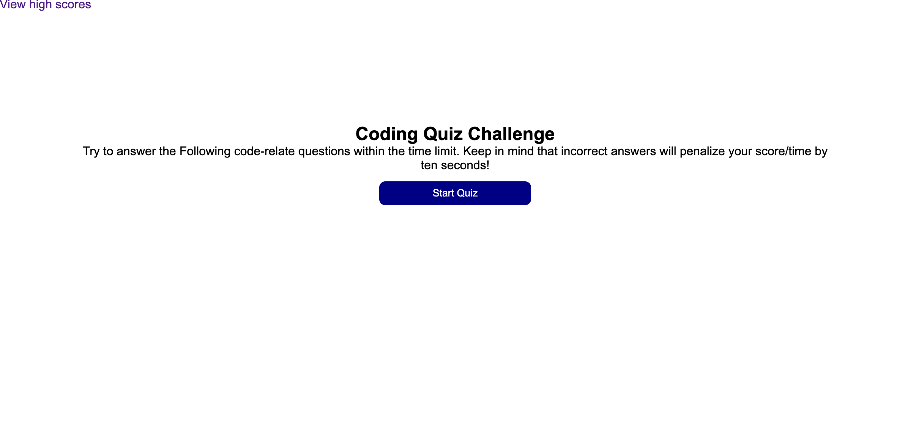

# <Code-Quiz>

## Description

I made this to quiz others, including myself, on their understanding of JavaScript. I learned a lot about localStorage!

## Installation

Navigate to:
https://colinsprows.github.io/code-quiz/highScore.html

## Usage

To start, simply click the Start Quiz button and follow the question prompts as they appear. If a question is answered wrong, you will be alerted, otherwise you will be brought to the next question. At the end, your score will be logged and can be viewed on the High Scores page.

## License

N/A

## Features

1. Quiz
2. High Scores